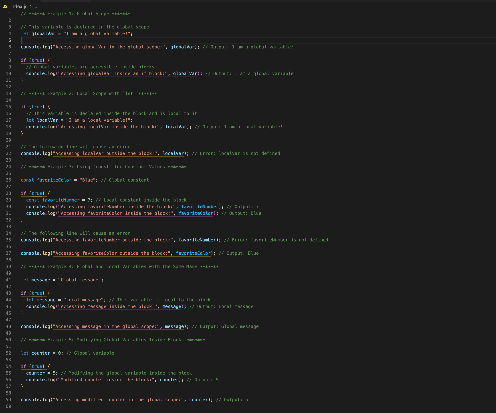

# JavaScript Scopes: Global vs Local



## Description 📄
In this assignment, you will explore how JavaScript handles variable scopes, specifically focusing on the differences between global scope and local scope. By understanding these concepts, you'll gain insights into how variable accessibility and modifications work within different contexts.

## Expected Project Structure 🏗️

```plaintext
js-scope-examples/
└── index.js
```

## Instructions ✅

### 1. **Create the Project Folder and Files**
   - [ ] Create a folder named `js-scope-examples` to store all your project files.
   - [ ] Inside the `js-scope-examples` folder, create a file named `index.js`. This file will contain all your JavaScript code demonstrating different scopes.

### 2. **Understanding Global Scope**
   - [ ] Use the following code to declare a global variable in your `index.js`.
     ```javascript
     let globalVar = "I am a global variable!";
     ```
   - [ ] Add a console log to display the global variable.
     ```javascript
     console.log("Accessing globalVar in the global scope.", globalVar); // Output: I am a global variable!
     ```
   - [ ] Use the global variable inside a block.
     ```javascript
     if (true) {
       console.log("Accessing globalVar inside an if block.", globalVar); // Output: I am a global variable!
     }
     ```
   - [ ] **Run the code.** Open your JavaScript console and run `node index.js`. Verify that the output matches.
     ```plaintext
     Accessing globalVar in the global scope. I am a global variable!
     Accessing globalVar inside an if block. I am a global variable!
     ```
   - [ ] **Comment out the code.** Before moving to the next step, comment out this code to avoid conflicts.
     ```javascript
     // let globalVar = "I am a global variable!";
     // console.log("Accessing globalVar in the global scope.", globalVar);
     // if (true) {
     //   console.log("Accessing globalVar inside an if block.", globalVar);
     // }
     ```
   - [ ] **Clear the terminal.** Type `clear` in the terminal to make sure the output from the next test is easily visible.

   **Explanation.**
   - In this step, you declared a global variable named `globalVar` and tested its accessibility. The console logs demonstrate that `globalVar` can be accessed both in the global scope and within a block (an `if` statement), highlighting that global variables are accessible anywhere in the script, regardless of block structure.

### 3. **Understanding Local Scope**
   - [ ] Use the following code to declare a local variable inside a block in your `index.js`.
     ```javascript
     if (true) {
       let localVar = "I am a local variable!";
       console.log("Accessing localVar inside the block.", localVar); // Output: I am a local variable!
     }
     ```
   - [ ] Attempt to access the local variable outside the block.
     ```javascript
     console.log("Accessing localVar outside the block.", localVar); // Error: localVar is not defined
     ```
   - [ ] **Run the code.** Run `node index.js` in your console and verify the output.
     ```plaintext
     Accessing localVar inside the block. I am a local variable!
     Error: localVar is not defined
     ```
   - [ ] **Comment out the code.** Before moving to the next step, comment out this code to avoid conflicts.
     ```javascript
     // if (true) {
     //   let localVar = "I am a local variable!";
     //   console.log("Accessing localVar inside the block.", localVar);
     // }
     // console.log("Accessing localVar outside the block.", localVar);
     ```
   - [ ] **Clear the terminal.** Type `clear` in the terminal to ensure the next output is clear.

   **Explanation.**
   - In this step, you declared a variable inside a block (inside an `if` statement). The console logs show that the variable is accessible only within that block, and trying to access it outside results in an error. This step demonstrates the concept of local scope, where variables are confined to the block they are declared in, preventing access from outside that block.

### 4. **Global and Local Variables with the Same Name**
   - [ ] Use the following code to declare a global variable in your `index.js`.
     ```javascript
     let message = "Global message";
     ```
   - [ ] Declare a local variable with the same name inside a block.
     ```javascript
     if (true) {
       let message = "Local message"; // This variable is local to the block
       console.log("Accessing message inside the block.", message); // Output: Local message
     }
     ```
   - [ ] Access the global variable outside the block.
     ```javascript
     console.log("Accessing message in the global scope.", message); // Output: Global message
     ```
   - [ ] **Run the code.** Run `node index.js` and check the output.
     ```plaintext
     Accessing message inside the block. Local message
     Accessing message in the global scope. Global message
     ```
   - [ ] **Comment out the code.** Before moving to the next step, comment out this code to avoid conflicts.
     ```javascript
     // let message = "Global message";
     // if (true) {
     //   let message = "Local message"; // This variable is local to the block
     //   console.log("Accessing message inside the block.", message); // Output: Local message
     // }
     // console.log("Accessing message in the global scope.", message);
     ```
   - [ ] **Clear the terminal.** Type `clear` in the terminal to ensure the next output is clear.

   **Explanation.**
   - You tested what happens when a global and a local variable share the same name. Inside the block, the local `message` variable shadows the global one, meaning the local version is used within the block, while the global variable remains accessible outside. This illustrates variable shadowing, where the closest scope takes precedence.

### 5. **Modifying Global Variables Inside Blocks**
   - [ ] Use the following code to declare a global variable in your `index.js`.
     ```javascript
     let counter = 0; // Global variable
     ```
   - [ ] Modify the global variable inside a block.
     ```javascript
     if (true) {
       counter = 5; // Modifying the global variable inside the block
       console.log("Modified counter inside the block.", counter); // Output: 5
     }
     ```
   - [ ] Access the modified global variable outside the block.
     ```javascript
     console.log("Accessing modified counter in the global scope.", counter); // Output: 5
     ```
   - [ ] **Run the code.** Execute `node index.js` and verify the results.
     ```plaintext
     Modified counter inside the block. 5
     Accessing modified counter in the global scope. 5
     ```
   - [ ] **Comment out the code.** Before moving to the next step, comment out this code to avoid conflicts.
     ```javascript
     // let counter = 0; // Global variable
     // if (true) {
     //   counter = 5; // Modifying the global variable inside the block
     //   console.log("Modified counter inside the block.", counter); // Output: 5
     // }
     // console.log("Accessing modified counter in the global scope.", counter);
     ```
   - [ ] **Clear the terminal.** Type `clear` in the terminal to ensure the next output is clear.

   **Explanation.**
   - In this step, you modified a global variable inside a block. The changes made within the block are reflected globally, indicating that global variables can be altered from within any block scope. This highlights how changes to global state from local contexts can affect the entire program, emphasizing the need to manage global state carefully.

### 6. **Modifying Local Variables Outside Blocks**
   - [ ] Use the following code to declare a local variable inside a block in your `index.js`.
     ```javascript
     if (true) {
       let counter = 10; // Local variable inside the block
       console.log("Counter inside the block.", counter); // Output: 10
     }

     counter = counter + 1; // Trying to increment the local variable outside the block
     console.log("Modified counter outside the block.", counter); // Expected Error: counter is not defined
     ```
   - [ ] **Run the code.** Execute `node index.js` and check the output.
     ```plaintext
     Counter inside the block. 10
     Error: counter is not defined
     ```

   **Explanation.**
   - In this example, you declared a local variable `counter` inside a block. When attempting to increment `counter` outside the block, JavaScript throws an error (`ReferenceError: counter is not defined`) because `counter` only exists within the block where it was declared. This illustrates the strict boundaries of block-scoped variables and highlights the importance of understanding variable scope in JavaScript.

## Conclusion 📄
By completing this project, you should have a clearer understanding of JavaScript variable scopes, the differences between global and local scopes, and how to manage variable accessibility effectively. You now have the skills to control when and where variables are accessible in your JavaScript code, which is crucial for writing clean and error-free programs.

##

### Solution codebase 👀
🛑 **Only use this as a reference** 🛑

💾 **Not something to copy and paste** 💾

**Note.** This lab references a solution file located [here](https://github.com/HackerUSA-CE/aisd-jse-scope/tree/solution) (link not shown).

---

© All rights reserved to ThriveDX
